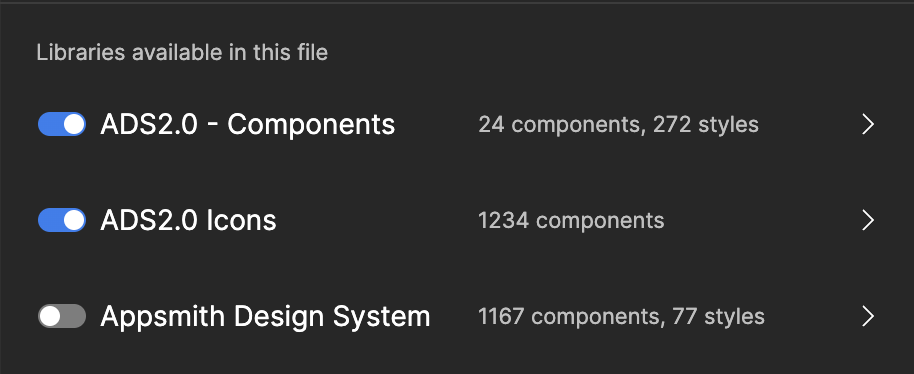

import { Meta } from '@storybook/blocks';

<Meta title="Introduction" />

# Welcome to Appsmith Design system (ADS) 2.0

This site contains examples and documentation of all of the building blocks used to build the Appsmith platform. This re-write of Appsmith design system is significantly different from the previous iteration and requires you to understand a few basic concepts in order to maximise your productivity as a designer/engineer consuming ADS 2.0.

### Experience goals

- Ease of use: We want to minimise the interpretation that requires for a person in terms of how to style their UI, using strong defaults.
- Flexibility of design: We provide flexibility through a robust set of tokens in case the components do not meet your needs

## How to access ADS 2.0

### For Designers

Designers can access the components and tokens from ADS2.0 through Figma’s asset library panel.

[//]: # (TODO: Add link to https://www.notion.so/appsmith/Start-here-b2920682bb0a441b85ce83135cdc6ef0?pvs=4#fb3a9f9a172b4f8e8710640a612ca9a9 via youtube and mdx-embed)

Toggle the ADS2.0 components and Icon libraries from the Figma asset library panel, as shown above. You will see all the components and icons show up here. Drag the desired component you want to use to your Figma canvas.

Ensure that you have the old library, referred to as Appsmith Design system, toggled off! This library will be deprecated soon.

### For Engineers

The component library is available on [npm](https://www.npmjs.com/package/@appsmithorg/design-system) and the source code on [github](https://www.github.com/appsmithorg/design-system).

To make changes to the library, refer to the [README](https://github.com/appsmithorg/design-system/blob/release/packages/design-system/README.md).

To use a specific component, refer to the docs for the component in the [storybook](design-system.appsmith.com/) here.

[//]: # (TODO: Link category tokens story here)
To use tokens created by ads in your own components, refer to [the story in the storybook.]()

Design files you receive will almost certainly be using components or compositions of components alone. If you find that you are having to build a component from scratch, please confer with your designer if there’s an alternative using established components, or ask someone from the design-system team if you can develop the new component within the design-system repository, before proceeding to build the custom component. We are all responsible for ensuring the experience we deliver is consistent and as solid as a rock 🪨.

## How to use ADS?

Everything you design/code should be:

- a component from ADS 2.0, or,
- composed of components from ADS 2.0.

You have the provision to style your design using the tokens from ADS2.0 if the above two cases do not meet your need.

Every component and it’s comprising parts in ADS2.0 has been styled using design tokens in order to ensure consistency and to achieve cohesiveness across the components.

### Learn more about Design tokens

[Design tokens in ADS](https://www.notion.so/Design-tokens-in-ADS-4e362fbc683f4bfdb7b93000b822b889?pvs=21)

<aside>
  ☝ **Remember this operating principle**
  Use components from ADS2.0. If they do not meet your need and you have a unique use-case to design for, use tokens. Anything else is not accepted as it would break the consistency of the designs within the product.

</aside>
